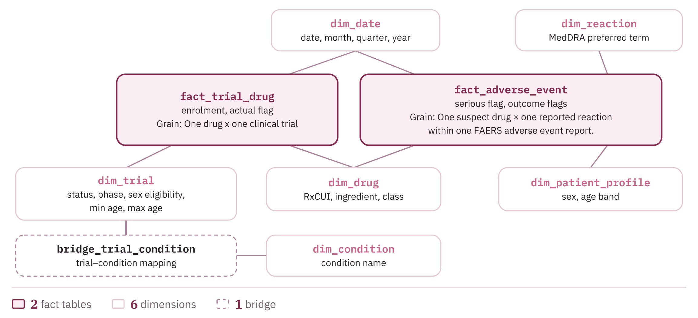

# Women in Drug Research and Safety

Data Engineering (University of Tartu, fall 2026), Project 1: data architecture and modelling.

**Team:** Anett Sitsi, Ann Marleen Varul, Anne-Mai Melles, Beatrice Hellrand, Oskar Telgmaa

## Goal

Compare how women are represented in clinical research with how they appear in post-market drug safety reports, to flag drugs and conditions where the two diverge. The full design (business brief, architecture, data model, data dictionary) is in the project report.

## Data sources

| Source | What it gives us | Access | Refresh |
| --- | --- | --- | --- |
| [openFDA adverse events (FAERS)](https://open.fda.gov/apis/drug/event/) | Individual adverse event reports: suspect drugs, reactions (MedDRA), patient sex and age, seriousness | REST API, optional free key | Quarterly |
| [ClinicalTrials.gov API v2](https://clinicaltrials.gov/data-api/api) | Registered trials: status, phase, eligible sex and ages, conditions, interventions, enrollment | REST API, no key | Daily |

Both sources are record-level (not pre-aggregated). The two are linked through `dim_drug`: drug names from both sides are mapped to an RxNorm ingredient code (RxCUI).

## Repository contents

```
sql/
  pseudo_queries.sql     SQL answering the five business questions
  schemas.sql            SQL for creating the star schema tables
scripts/
  download_fda.py        pulls recent FAERS reports, flattened to the fact grain
sample_data/             small samples produced by the two scripts
```

## Star schema

2 fact tables, 6 dimensions and 1 bridge table.


| Table | Grain | SCD type |
| --- | --- | --- |
| fact_adverse_event | One row per suspect drug per reaction per FAERS report (latest version) | n/a |
| fact_trial_drug | One row per drug per trial | n/a |
| dim_trial | One row per version of a trial | Type 2 (status history) |
| dim_drug | One row per RxNorm ingredient | Type 1 |
| dim_condition | One row per condition text | Type 1 |
| dim_reaction | One row per MedDRA preferred term | Static |
| dim_patient_profile | One row per sex and age band (15 rows) | Static |
| dim_date | One row per day, 2000 to 2035 | Static |

`bridge_trial_condition.nct_id` is not a formal foreign key: `dim_trial` keeps several rows per trial (one per version), so queries join it to the current row (`is_current`).

## Running the SQL

```bash
createdb drug_safety
psql -d drug_safety -f sql/pseudo_queries.sql   # returns empty results until the facts are loaded
```

Loading the fact tables is part of Project 2 (Airflow + dbt).

## Downloading sample data

Requires Python 3.10+ and `requests` (`pip install requests`).

```bash
export OPENFDA_API_KEY=...                       # optional; higher daily limit
python scripts/download_fda.py --months 24 --max-reports 5000
python scripts/download_ctgov.py --updated-since 2024-10-01 --max-studies 2000
```

Each script saves the raw API response as JSON (the raw landing layer) and flattened CSVs:

| File | Grain | Feeds |
| --- | --- | --- |
| `fda_reports_sample.csv` | suspect drug x reaction x report | fact_adverse_event, dim_drug, dim_reaction, dim_patient_profile |
| `ctg_trials_sample.csv` | trial | dim_trial |
| `ctg_trial_drugs_sample.csv` | drug x trial (DRUG and BIOLOGICAL only) | fact_trial_drug, dim_drug |
| `ctg_trial_conditions_sample.csv` | condition x trial | dim_condition, bridge_trial_condition |

Source codes decoded during transformation:

| Source field | Code | Meaning |
| --- | --- | --- |
| FAERS `serious` | 1 / 2 | serious / not serious |
| FAERS `patientsex` | 0 / 1 / 2 | unknown / male / female |
| FAERS `patientonsetageunit` | 801 / 802 / 803 / 804 / 805 / 800 | years / months / weeks / days / hours / decades |
| FAERS `drugcharacterization` | 1 / 2 / 3 | suspect / concomitant / interacting (only 1 is kept) |
| ClinicalTrials.gov `enrollment_type` | ACTUAL / ESTIMATED | `is_enrollment_actual` TRUE / FALSE |

FAERS `rxcui` values are product-level codes; they are mapped to ingredient-level RxCUIs with the [RxNav API](https://lhncbc.nlm.nih.gov/RxNav/APIs/) before loading `dim_drug`. The openFDA API pages through at most 25,000 records per query, so the full load uses the [quarterly bulk files](https://open.fda.gov/data/downloads/) instead.

## Limitations

FAERS is spontaneous reporting with no denominator: it shows reporting patterns, not how often reactions occur. ClinicalTrials.gov eligibility shows who could enrol, not how many women actually took part.
